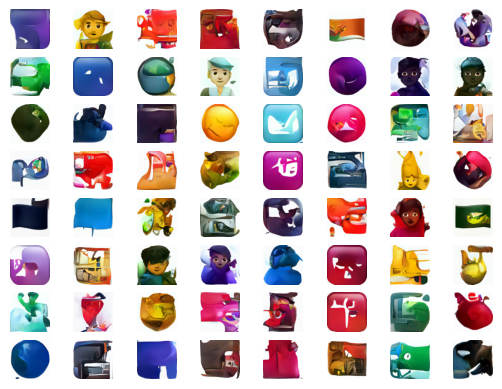

# EmojiDM: Generate Emoji via Diffusion Models


---

## 🚀 Project Overview

**EmojiDM-** is an open‑source project that trains a diffusion‑based generative model to create novel emoji designs with state‑of‑the‑art denoising diffusion probabilistic models (DDPM).

This model is trained on this dataset:
https://huggingface.co/datasets/valhalla/emoji-dataset

- Train custom diffusion pipelines on emoji and icon collections  
- Sample high‑quality, diverse emoji at various resolutions  

In raw notebook is located at `notebook.ipynb`.

To view the notebook with output, click this colab link. 
Google Colab Link: 
https://colab.research.google.com/drive/1qrl8YyZ_YuLPY-lgwOMS2MLe7WH9USos#scrollTo=WoI_Y05h5GEw

---

This repo implements a denoising diffusion pipeline:
1. **Dataset & Dataloader**: custom PyTorch `Dataset` + Matplotlib preview  
2. **UNet Model**: via HuggingFace Diffusers  
3. **Schedulers / Samplers**: DDPM, DDIM, LMS, etc.  
4. **Training Loop**: noise‐to‐noise training  
5. **Inference**: multi‐step reverse diffusion, with optional guidance  
6. **Visualization**: sample grids, loss curves, metrics (FID / IS)


## 📸 Results


Here are some of the emoji created:




---

### Prerequisites

- Python 3.8+  
- CUDA‐enabled GPU (recommended)  

## ⚙️ Installation

1. **Clone the repo**  
   ```bash
   git clone https://github.com/GunaDD/emoji-diffusion-model.git
   ```

2. Create & activate your virtual environment

3. Install dependencies
```bash
pip install -r requirements.txt
```
